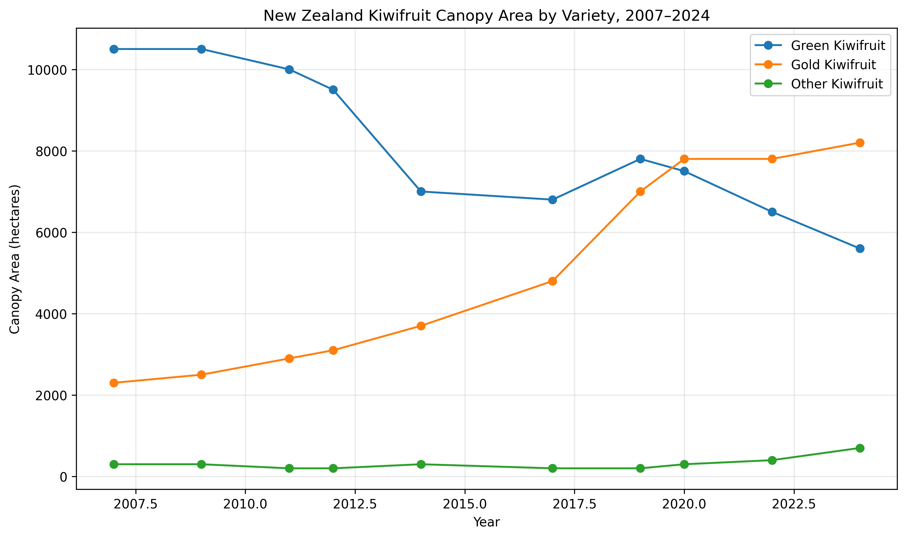
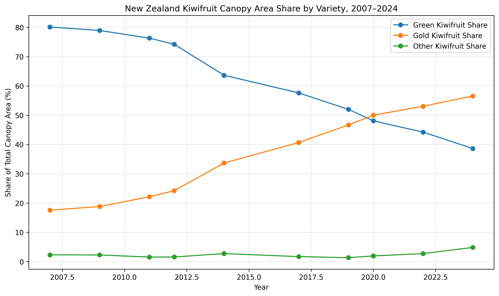
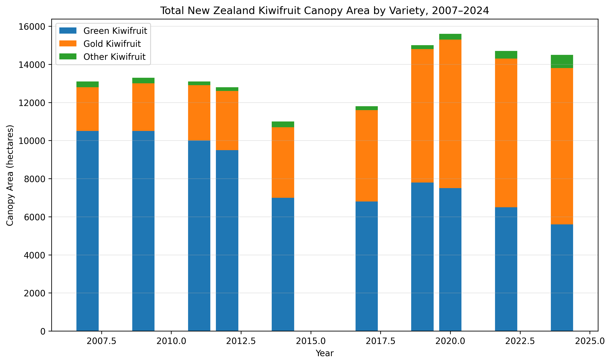

# New Zealand Kiwifruit Canopy Area Analysis 2007–2024

## Project Overview

This data science project analyses New Zealand kiwifruit canopy area trends from 2007 to 2024 using public data from Stats NZ.

The goal of this project is to understand how New Zealand's kiwifruit industry has changed over time, especially the shift between green, gold, and other kiwifruit varieties.

## Dataset

The dataset used in this project is based on the Stats NZ Agricultural Production Statistics table:

Source: Stats NZ Agricultural Production Statistics: Year to June 2024 final.

**Kiwifruit canopy area hectares by variety, 2007–2024**

The dataset includes:

- Year
- Green kiwifruit canopy area
- Gold kiwifruit canopy area
- Other kiwifruit canopy area

## Project Questions

This project explores the following questions:

1. How has green kiwifruit canopy area changed over time?
2. How has gold kiwifruit canopy area changed over time?
3. When did gold kiwifruit overtake green kiwifruit?
4. What percentage of total canopy area is green, gold, and other kiwifruit?
5. What story does this trend tell about the New Zealand kiwifruit industry?

## Tools Used

- Python
- Pandas
- Matplotlib
- Jupyter Notebook
- VS Code

## How to Run This Project

1. Clone the repository:

```bash
git clone git@github.com:chrisbigdog/nz-kiwifruit-canopy-analysis.git
```

2. Move into the project folder:

```bash
cd nz-kiwifruit-canopy-analysis
```

3. Install the required Python packages:

```bash
pip install -r requirements.txt
```

4. Open the notebook:

```bash
jupyter notebook notebooks/01_kiwifruit_canopy_analysis.ipynb
```

Or open the project in VS Code and run the notebook using a Python environment with the required packages installed.

## Project Structure

```text
nz-kiwifruit-canopy-analysis/
│
├── data/
│   ├── kiwifruit_canopy_area.csv
│   └── kiwifruit_canopy_area_processed.csv
│
├── notebooks/
│   └── 01_kiwifruit_canopy_analysis.ipynb
│
├── visuals/
│   ├── kiwifruit_canopy_area_line_chart.png
│   ├── kiwifruit_canopy_area_share_chart.png
│   └── kiwifruit_canopy_area_stacked_bar_chart.png
│
├── README.md
└── requirements.txt
```

## Early Insights

The data shows a major industry shift from green kiwifruit toward gold kiwifruit between 2007 and 2024.

Green kiwifruit canopy area declined over time, while gold kiwifruit canopy area grew strongly and became the largest variety by canopy area.

## Visuals

### Kiwifruit Canopy Area by Variety



### Kiwifruit Canopy Area Share by Variety



### Total Kiwifruit Canopy Area by Variety


## Status

This project is currently in progress.